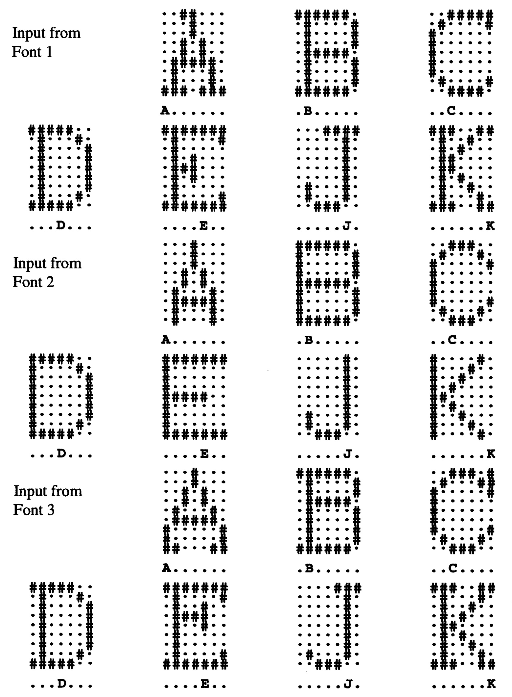

# Perceptron Character Recognition

This project utilizes a single-layer perceptron network to detect 7 different characters in 3 distinct fonts. Initial values, training data, and test data are sourced from Laurene Fausett's "Fundamentals Of Neural Networks" (pp. 71-76, character recognition example 2.14).

